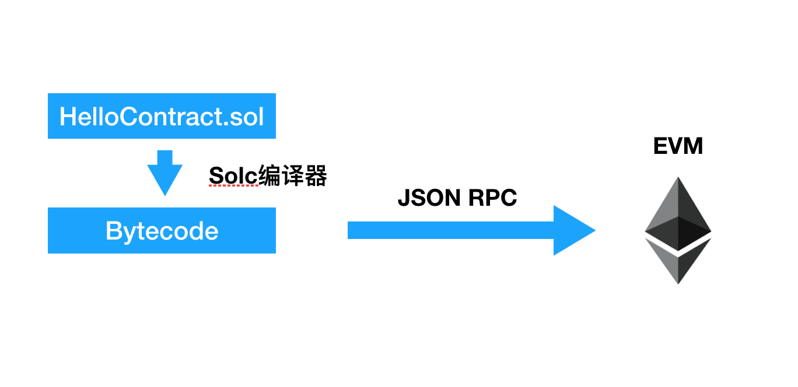

# 雷达哔哔哔 - Ethereum

## 位置
2017年3月第16期技术雷达，**平台**象限，建议**评估**

## 目标受众：
区块链产品经理、架构师、开发人员

## 关注问题：
在比特币货币网络启动后的几年，加密货币和区块链技术逐渐进入公众视野。虽然比特币主要目的是为金融交易提供信任支撑，但作为仅有一种单一的状态主体（比特币）、无法图灵完备进行编程的区块链网络，其对于区块链技术的运用场景非常受限。  
而为了在区块链技术上，或者说是为了在比特币引领的密码学货币的基础上（以太坊白皮书中提到）构建高级应用，以太坊做出了打造开源平台的尝试。

## 解决方案：
以太坊在借鉴了比特币，同样使用了底层密码学货币、区块链、去中心化的共识机制和矿工机制基础上，提供了以Solidity为首选的四种专用编程语言和虚拟机EVM，支持图灵完备的智能合约，用以支持在此平台上构建更为复杂和灵活的区块链应用。

## 解读：
一个一直以来的说法——如果把比特币网络看成是全球账本的话，那么就可以把以太坊看做是一台“全球计算机”。  

智能合约，作为运行在这台全球计算机上的主体，是以太坊最重要的概念之一，即以计算机程序的方式来缔结和运行各种合约 —— 满足合约条件即会强制执行，执行结果会对以太坊网络上记录的状态进行更新。这些修改由于经过了以太坊网络中的共识，一旦确认后无法被伪造和篡改。

在以太坊这个平台上，对于智能合约的编写和发布，基于以下几个条件：  
* 运行环境：EVM虚拟机  
* 开发语言：Solidity（类JavaScript）、solc编译器  
* 燃料：Gas，通过以太币换取  
* 账户：以太币拥有者的账户，由私钥控制  

上图中：  
1. 开发者使用Solidity语言编写智能合约文件，由Solc编译工具将合约文件编译成字节码。  
2. 使用可以与以太坊节点通讯的JSON RPC工具(如JavaScript版本的Web3.js)，向以太坊节点发送一条“创建合约”的交易。  
3. 以太坊节点接收到此交易后，先检查该开发者账户上是否有足够的以太币余额用以支付交易中声明的Gas。如果足够，节点开始创建合约，并消耗Gas。
 
以太坊中，Gas是个有意思的设定。以太币会被定义为燃料货币基本来源于此。
 一方面，它让交易发送方承担运行交易的成本；另一方面，可以用来预防过重、过长的合约执行，以及保护以太网络受到无限循环的蓄意攻击。    
 
在发送的交易中，会有两个固定部分：gasLimit和gasPrice。  
* gasLimit: 发送方愿意支付的执行这一交易的Gas最大数量。这个数额是预先设定和支付的。  
* gasPrice：发送方愿意支付每单位Gas所需执行交易的GWei数量。  
* gasLimit x gasPrice，就是发送方愿意为此次交易支付的以太币成本。  

在每一次交易中，gasLimit用来控制交易执行指令的上限。如果实际消耗的gas小 于gasLimit，剩余的gas会被退回给发送方；如果一个交易过于复杂到还未执行结束，而gas已经消耗完时，交易执行终止并且状态回滚。  
gasPrice，主要用来提升交易的“打包费”，price越高越容易被矿工提前打包进区块。

因此，智能合约的编写，应该秉承尽量简单的原则，不然成本就会相当昂贵。

## 相关Blip
* [Solidity | Languages and Frameworks | Technology Radar | ThoughtWorks](https://www.thoughtworks.com/radar/languages-and-frameworks/solidity)
* [Truffle | Languages and Frameworks | Technology Radar | ThoughtWorks](https://www.thoughtworks.com/radar/languages-and-frameworks/truffle)
* [Openzeppelin | Languages and Frameworks | Technology Radar | ThoughtWorks](https://www.thoughtworks.com/radar/languages-and-frameworks/openzeppelin)
* [Ethereum | Platforms | Technology Radar | ThoughtWorks](https://www.thoughtworks.com/radar/platforms/ethereum)
* [Quorum | Platforms | Technology Radar | ThoughtWorks](https://www.thoughtworks.com/radar/platforms/quorum)

## 延展阅读
* [以太坊白皮书](https://github.com/ethereum/wiki/wiki/White-Paper)
* [以太坊黄皮书](https://ethereum.github.io/yellowpaper/paper.pdf)
* [How does Ethereum work, anyway?](https://medium.com/@preethikasireddy/how-does-ethereum-work-anyway-22d1df506369)
* [Diving Into The Ethereum Virtual Machine](https://blog.qtum.org/diving-into-the-ethereum-vm-6e8d5d2f3c30)

## 工具：
* [Solidity](https://solidity.readthedocs.io/en/v0.4.24/)
* [EVM](https://github.com/ethereum/wiki/wiki/Ethereum-Virtual-Machine-(EVM)-Awesome-List)
* [Truffle](https://github.com/trufflesuite/truffle)
* [Ganache](https://truffleframework.com/ganache)
* [MetaMask](https://metamask.io/)
