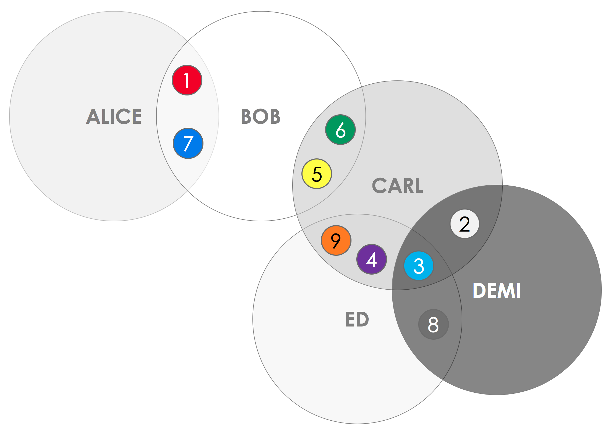
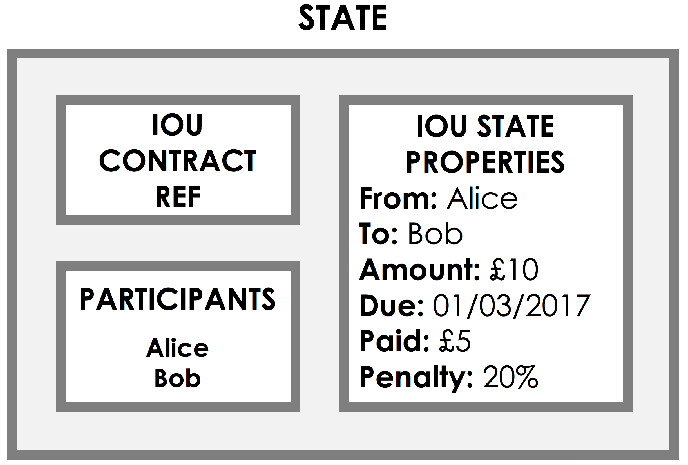
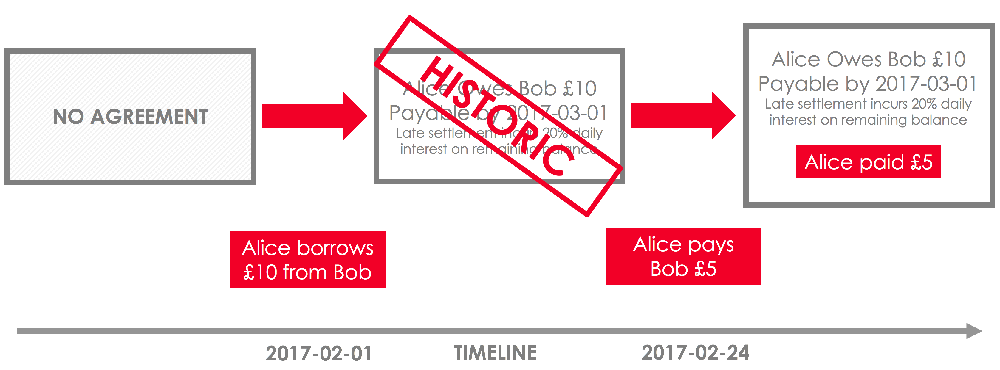
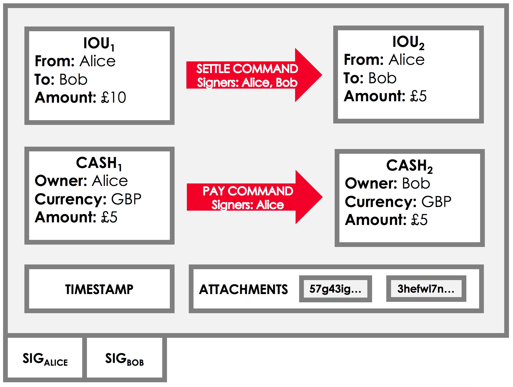
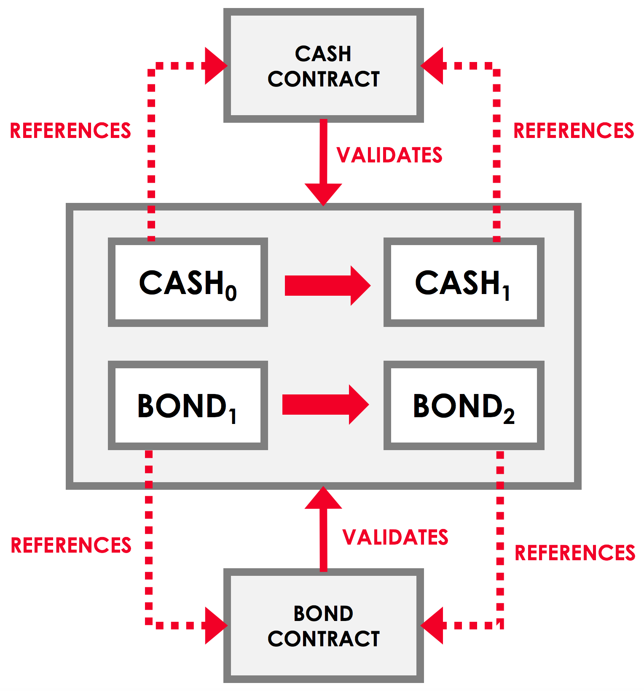
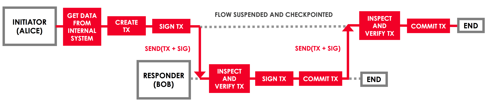

# 分布式账本 Corda

最近在项目中用到了分布式账本 Corda，本文介绍一下 Corda 的基本概念和编程模型。

## Corda 是区块链吗？

Corda 开发文档的第一句话是这么写的：

> [Corda](https://www.corda.net/) is a blockchain-inspired open source distributed ledger platform.

翻译：“Corda 是受区块链启发的开源分布式账本平台。”

在 Corda 究竟是不是区块链技术这件事情上存在争议，原因是与比特币，以太坊等典型区块链平台相比，Corda 舍弃了每一个节点都要验证和记录每一笔交易的账本全网广播模式，仅仅要求每一笔交易的参与方对交易进行验证和记录：

图中，在 Alice 和 Bob 之间发生了 fact 1，那么只有 Alice 和 Bob 需要验证 fact 1 的合法性，并且记录下来，Carl，Demi 和 Ed 对相关信息一无所知。

这样做的好处主要是解决了分布式账本技术在商业化应用中非常敏感的两个问题：

- 极大地提高了交易的吞吐能力；
- 避开了共享账本能否保证交易数据私密的争议。

同时也带来了问题，即如何避免“双花”。在比特币和以太坊等区块链平台上，由于每个节点都拥有整个账本的复制，所以要解决双花问题很容易。Corda 为解决双花问题，引入了 notary 机制，简单来说就是在 notary 节点之间形成更广泛的共识，而 Corda 上的每一笔交易都需要通过至少一个 notary 节点的验证。

回到开始的问题，Corda 是区块链吗？其实这个问题的答案并不重要，重要的是 Corda 使用了分布式账本技术，并且做了针对性的改良，使 Corda 非常适用于企业对企业的交易应用场景。

## Corda 的编程模型

接下来讲一下 Corda 开发当中的几个核心概念——state，transaction，contract，flow。

### 1. State

#### 1.1. State 的数据结构

简单来说 state 就是不可篡改的链上数据，一个 state 的数据结构如下图所示：

图中主要有3个部分：

1. 右边是数据本身，例如图中描述了 Alice 欠 Bob 的10美元的情况；
2. 左上是这条数据所关联的 contract，这部分会在 [Contract](#2.-contract) 中详细介绍；
3. 左下是 participants，这是 Corda 当中特别重要以及特别需要设计的一个概念，上文提到 Corda 不会在每个节点

上记录每笔交易，participants 表示哪些节点需要记录这条 state 数据，同时也意味着哪些节点能够看到并发起对相应 state 数据的修改。

State 是不可篡改的，当真实世界中的事实发生变化时，Corda 会将已经成为历史的 state 标记为 consumed。

### 2. Transaction

Transaction 表示一笔交易，交易由所有发生变化的 state，造成 state 变化的 command，交易参与方的签名，时间戳以及交易相关附件组成。

上文中我们提到存储在链上的数据是 state，但是实际上真正存储在链上的原始数据是这一笔笔 transaction。State 是 transaction play 的结果。

### 3. Contract

Contract 用来验证 transaction。一笔交易一定发生在多个不同的对手方之间，通常来讲一笔交易由一方构建，另外的参与方验证交易有效。所以交易构建方要在 state 上指明这笔交易是通过哪个 contract 的哪个 command 生成的。验证方通过调用对应 contract 上的 verify 方法验证交易有效。

通常来讲一笔交易要验证的部分包括交易参与方的签名，以及 state 的转化是否是合理两个部分。

### 4. Flow

刚才提到一笔交易由一方构建，其余参与方验证并签字。在 Corda 中，我们用 flow 来管理这个过程：

图中 initiator 和 responder 分别是交易双方执行的 flow，双方的交互通过 flow 来控制。Corda 还把很多有用的小步骤封装成了 flow，以便开发者调用，比如 CollectSignaturesFlow。

## 传统交付模式在区块链交付中面临的挑战

### Trust, but VERIFY

Verify 是区块链开发中非常重要的一个部分。上面我们提到在 Corda 的编程模型中由一方构建交易，其他参与方验证交易的模式。那么验证是否足够健壮就成为了开发过程当中很重要的一环，每一个合约安全漏洞，都会造成数额巨大的直接经济损失。

另一方面，对 verify 逻辑的验证又很难融入到我们的传统开发流程中。在传统开发中，我们以功能开发为主，安全往往是被我们放在第二优先级的需求。但是在区块链开发中，即便我们完全不进行 verify，功能也可以正常完成。所以 verify 逻辑是否足够健壮就完全成为了开发人员自己的事情。

为了解决这个问题，业界提出了用"形式化证明"的方式来验证智能合约的安全性，目前已经有大量创业公司投入在这个方向上，预计未来将会出现一些智能合约验证工具出现在区块链开发的工具链上。

### 区块链和 DevOps

区块链开发面临的另一个挑战是 DevOps。以往 DevOps 的目标是将程序部署在一个环境里，不管这个环境是数据中心，还是云端。在区块链开发中，我们希望不同的节点部署在不同参与方的环境中。

例如，A 可能希望部署一个节点在他们的 AWS 环境上，B 希望部署在他们的数据中心里，C 希望部署在 Aliyun 环境上，如何快速地将这些环境打通并形成 P2P 网络就成了一个问题。这个问题并不难以解决，但是还远远谈不上可以高效解决。未来也可能会出现一批针对区块链开发的 DevOps 工具帮助我们解决这些问题。